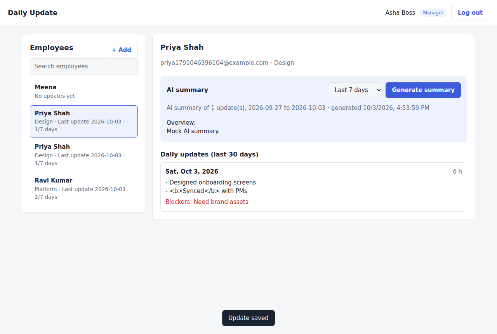

# Daily Update Website

A web app where employees log the work they did each day, and managers log in to see every employee and read an AI-written summary of what each person has been working on. No email involved: everything happens on the website.

| Employee view | Manager view |
|---|---|
|  |  |

## Features

**Employees**
- Sign up and log in
- Write a daily update: what they worked on, hours (optional), blockers (optional)
- Edit the day's update by saving again, and delete their own entries
- See their recent history

**Managers**
- See a searchable list of all employees, with each person's last update date and how many days they logged this week
- Open any employee to read their daily updates for the last 30 days
- Generate an AI summary for the last 7, 14 or 30 days (overview, key accomplishments, blockers and risks, time, suggested follow-ups)
- Create employee or manager accounts

## Architecture

The app is split into small services, each owning its own data, behind one gateway.

```
Browser ──► frontend (nginx: static site + API gateway, :8080)
              ├── /api/auth, /api/users ──► auth-service     (users, passwords, login tokens)
              ├── /api/logs             ──► worklog-service  (daily work logs)
              └── /api/summaries        ──► summary-service  (AI summaries, calls Claude)
                                                │
                     all services ──────────────┴──► PostgreSQL
```

| Service | Folder | Owns | Notes |
|---|---|---|---|
| frontend | `frontend/` | Static HTML/CSS/JS | nginx also routes `/api/*` to the right service and sets security headers |
| auth-service | `services/auth-service/` | `users` table | Sign-up, login, roles, employee list |
| worklog-service | `services/worklog-service/` | `work_logs` table | One entry per employee per day |
| summary-service | `services/summary-service/` | `summaries` table | Fetches logs from worklog-service, asks Claude to summarize, saves the result |
| db | (docker image) | PostgreSQL 17 | Each service creates its own tables on start |

Services are Node.js 22 + Express. The summary-service calls the other services with the manager's own login token, so every service checks permissions itself.

## Security

- Passwords hashed with bcrypt (cost 12); login gives the same error for unknown email and wrong password.
- Signed JWT login tokens (HS256, 8 hour expiry); every API checks the token and role.
- Role rules: employees can only read and change their own logs; only managers can list employees, read other people's logs, and generate summaries. Self sign-up always creates an employee.
- Rate limits on login/sign-up (20 per 15 minutes per IP) and on AI summaries (30 per hour per manager).
- All SQL is parameterized; request bodies are size-limited and validated.
- Helmet security headers on every service, plus a strict Content Security Policy, `X-Frame-Options: DENY` and `nosniff` from nginx. The frontend never renders user text as HTML.
- Employee text sent to the AI is wrapped as data and the model is told never to follow instructions inside it.
- Only the frontend port is published; the database and services are on a private Docker network. Secrets come from `.env`, which is git-ignored.

For production, put the site behind HTTPS (for example a reverse proxy or load balancer with a TLS certificate).

## Run it

You need [Docker](https://docs.docker.com/get-docker/) with Docker Compose.

```bash
git clone https://github.com/aithalvishwas/daily-update-website.git
cd daily-update-website
cp .env.example .env
```

Edit `.env`:

- `POSTGRES_PASSWORD`: any long random password
- `JWT_SECRET`: at least 32 characters, e.g. the output of `openssl rand -hex 32`
- `MANAGER_EMAIL` / `MANAGER_PASSWORD`: the first manager account, created on first start
- `ANTHROPIC_API_KEY`: your Anthropic API key for AI summaries (get one at [console.anthropic.com](https://console.anthropic.com)). Without it the app still works and shows a basic, non-AI summary.

Then start everything:

```bash
docker compose up -d --build
```

Open http://localhost:8080. Log in as the manager from `.env`, or use **Sign up** to create employee accounts.

Stop with `docker compose down` (add `-v` to also delete the database).

## API

All endpoints except sign-up and login need `Authorization: Bearer <token>`.

| Method | Path | Who | Purpose |
|---|---|---|---|
| POST | `/api/auth/register` | anyone | Create an employee account, returns a token |
| POST | `/api/auth/login` | anyone | Log in, returns a token |
| GET | `/api/auth/me` | any user | Current user |
| GET | `/api/users` | manager | List employees |
| GET | `/api/users/:id` | manager | One user |
| POST | `/api/users` | manager | Create an employee or manager |
| POST | `/api/logs` | any user | Create or update the caller's log for a date |
| GET | `/api/logs/me?from=&to=` | any user | Caller's logs (default last 30 days) |
| DELETE | `/api/logs/:id` | owner | Delete own log |
| GET | `/api/logs/overview` | manager | Last log date and 7-day count per employee |
| GET | `/api/logs/user/:userId?from=&to=` | manager | An employee's logs |
| GET | `/api/summaries/:userId` | manager | Latest saved summary |
| POST | `/api/summaries/:userId` `{ "days": 7 }` | manager | Generate a new summary (7, 14 or 30 days) |

## Configuration

| Variable | Default | Used by |
|---|---|---|
| `APP_PORT` | `8080` | Port the website is published on |
| `POSTGRES_USER` / `POSTGRES_PASSWORD` / `POSTGRES_DB` | `dailyupdate` / required / `dailyupdate` | Database |
| `JWT_SECRET` | required | All services |
| `MANAGER_NAME` / `MANAGER_EMAIL` / `MANAGER_PASSWORD` | unset | auth-service, first-run manager |
| `ANTHROPIC_API_KEY` | unset | summary-service |
| `ANTHROPIC_MODEL` | `claude-opus-5-5` | summary-service |
| `AUTH_RATE_LIMIT` | `20` | Login/sign-up attempts per 15 min per IP |
| `SUMMARY_RATE_LIMIT` | `30` | Summaries per hour per manager |
