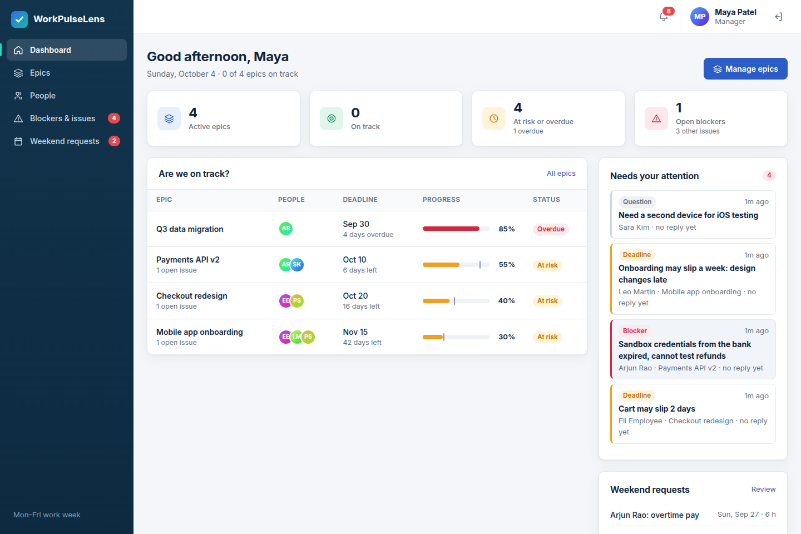
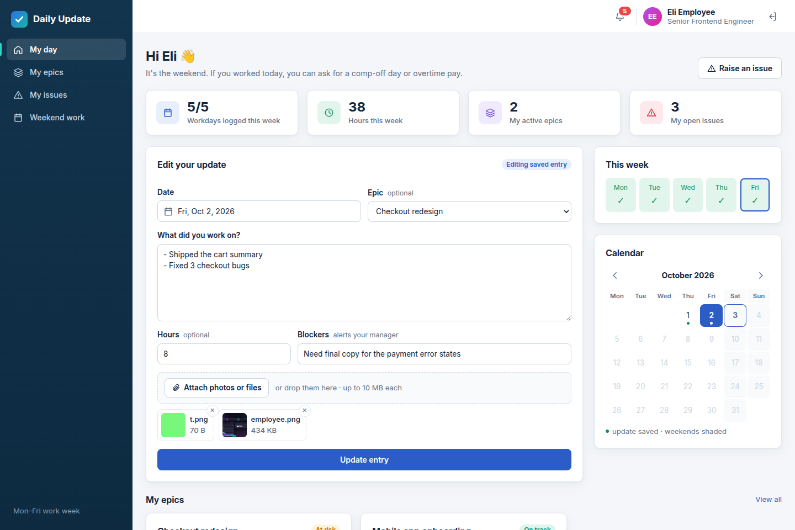
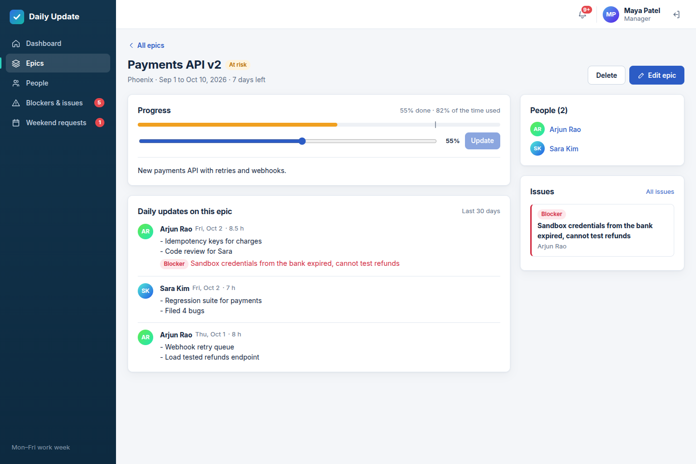
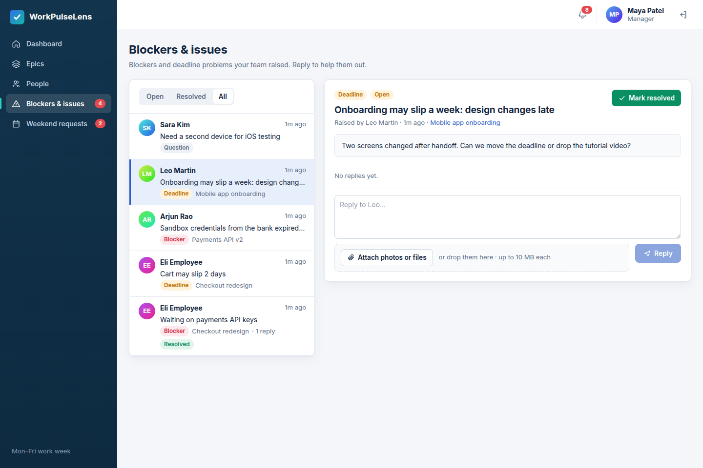
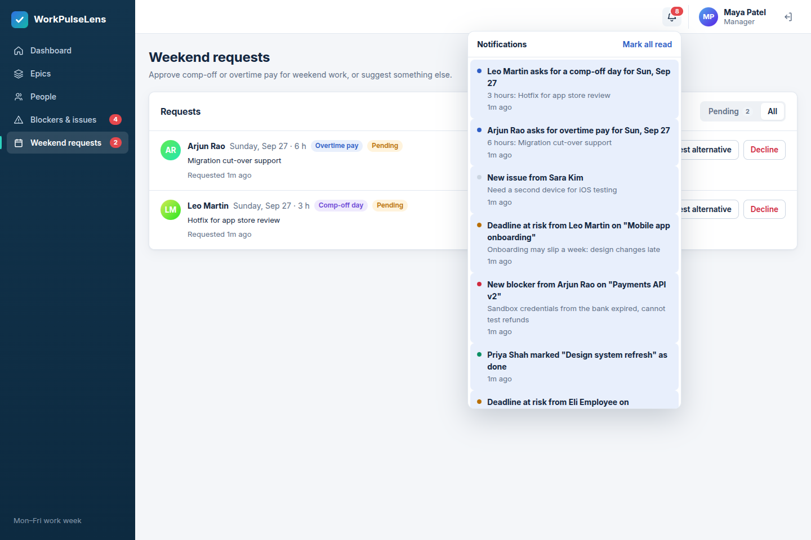
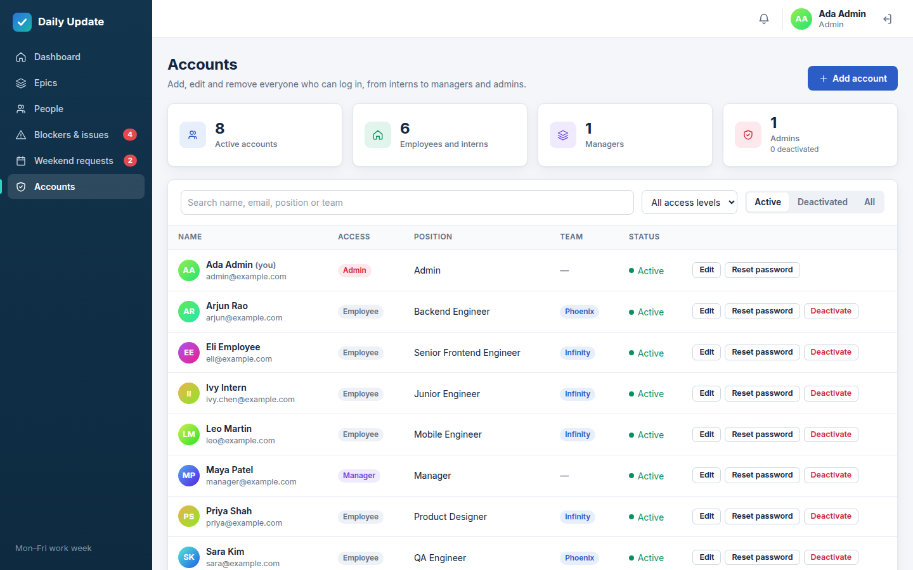
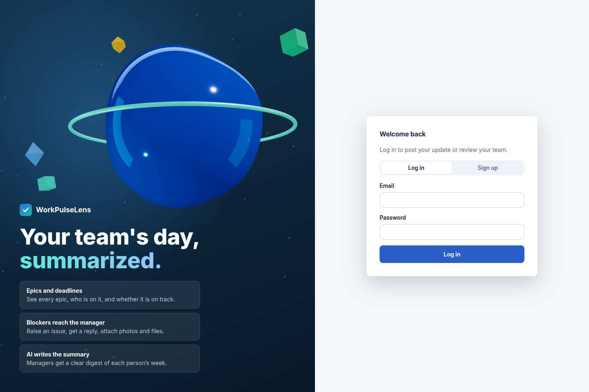
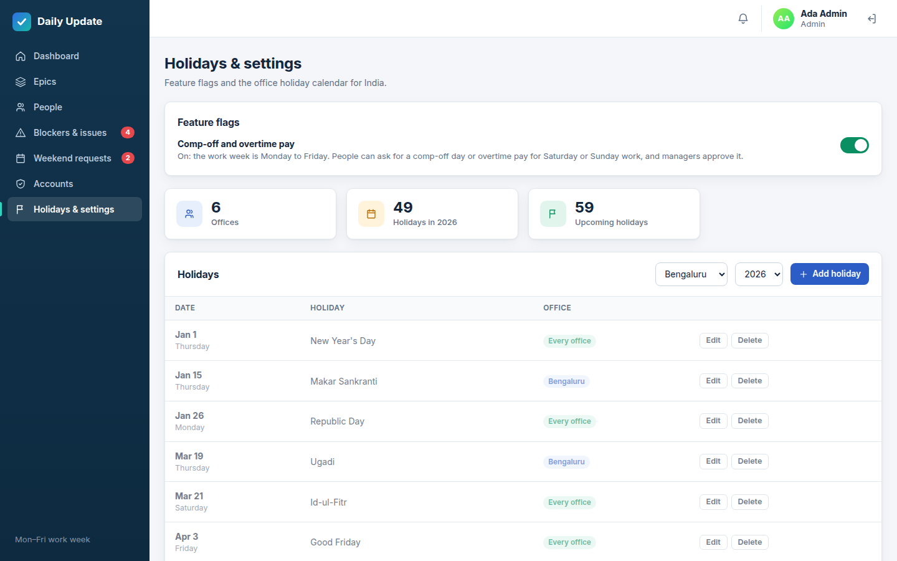

# Daily Update Website

A work app for teams: employees log what they did each day against the epics they work on, raise blockers and deadline problems, and claim weekend work; managers see whether every epic is on track, answer blockers, approve requests, and read an AI-written summary of each person's work. No email involved: alerts show up in the website's notification bell.



| Employee: my day | Epic detail |
|---|---|
|  |  |
| **Blocker conversation** | **Weekend requests and alerts** |
|  |  |

**Admin: accounts**



The login page keeps the three.js 3D scene:



## Features

**Managers**
- **Dashboard**: active epics, how many are on track, at risk or overdue, open blockers, alerts that need an answer, pending weekend requests, and who has posted today.
- **Epics**: create epics with a team, start date and deadline, and add any number of people (one person can be on several epics). Each epic shows progress against the time used, days left, open issues and a health badge: *On track*, *At risk* (more than 15 points behind schedule, or an open blocker or deadline issue), *Overdue* or *Done*. The epic page lists every daily update linked to it.
- **People**: everyone with their position, team and when they last posted (holidays at their office, and weekends in a Monday to Friday week, don't count against them). Edit a person to move teams, change position after a promotion, or give manager access; add new hires; create teams such as "Infinity".
- **Blockers & issues**: an inbox of blockers, deadline risks and questions. Reply (with photos or files), and mark them resolved. New blockers from daily updates arrive here automatically.
- **Weekend requests** (when the comp-off and overtime pay flag is on): approve or decline comp-off or overtime pay, or suggest an alternative (for example "take a comp-off day instead of pay").
- **AI summary** for any person over 7, 14 or 30 days.
- **Notifications** for new blockers, deadline risks, replies, weekend requests and epics marked done.

**Admins**
- Everything a manager can do, plus an **Accounts** page listing every login, from interns to managers and other admins.
- **Add** an account with name, email, position (for example *Intern*), team, access level (employee, manager or admin) and a generated temporary password.
- **Edit** anyone's name, login email, position, team or access level.
- **Reset a password**. The new one is shown once so you can share it.
- **Deactivate** ("delete") after a confirmation: the person can't log in and drops out of lists, pickers and alerts, but their history stays. Reactivate any time.
- **Holidays & settings**:
  - The **comp-off and overtime pay** feature flag. With it **off** (the default), all 7 days are normal workdays and there are no weekend requests. With it **on**, the week is Monday to Friday and people can claim comp-off or overtime pay for Saturday or Sunday work.
  - **Office holidays** for the India offices: Bengaluru, Chennai, Gurgaon, Hyderabad, Mumbai and Pune. A starter list for 2026 and 2027 is loaded on first start. Add, edit or delete holidays for one office or every office. Festival dates follow the lunar calendar, so check them against your official list.
  - Set anyone's office on the Accounts page.

  
- Safety rules: there is always at least one active admin, you can't deactivate yourself or remove your own admin access, and managers can't change admin accounts.

**Employees**
- **My day**: write the daily update for any workday using the calendar, link it to an epic, add hours and blockers, and attach photos or files. The page shows *workdays logged this week* and hours, with no streaks. Holidays at your office are highlighted on the calendar and never count as missed days. The week is all 7 days, or Monday to Friday when the comp-off and overtime pay flag is on.
- **Upcoming holidays** for your office, and **My settings** (click your name at the top) to pick the office you work from.
- **My epics**: deadlines, health and a slider to report progress.
- **Raise an issue** when something blocks you or a deadline is at risk; your manager is notified and replies in the same thread.
- **Weekend work** (when the flag is on): pick the Saturday or Sunday you worked, choose comp-off or paid, and follow the manager's answer. Accept their alternative or cancel the request.
- **Notifications** when you're added to an epic, when your manager replies, and when a request is decided.

## Project layout

```
daily-update-website/
├── frontend/   React + Vite website (three.js 3D scenes) and the nginx gateway
├── backend/    Java 21 / Spring Boot microservices (Maven multi-module)
│   ├── common/           shared JWT security, error handling, rate limiting
│   ├── auth-service/     users, passwords, login tokens
│   ├── worklog-service/  daily work logs
│   ├── summary-service/  AI summaries (calls Claude)
│   └── project-service/  epics, issues, notifications, weekend requests, attachments
├── config/     docker-compose.yml and .env.example
└── docs/       Screenshots
```

## Architecture

```
Browser ──► frontend (nginx: React build + API gateway, :8080)
              ├── /api/auth, /api/users, /api/teams,  ──► auth-service     (:4001)
              │   /api/admin, /api/workplace
              ├── /api/logs                           ──► worklog-service  (:4002)
              ├── /api/summaries                      ──► summary-service  (:4003) ──► Claude API
              └── /api/epics, /api/issues,            ──► project-service  (:4004) ──► uploads volume
                  /api/weekend-requests,
                  /api/notifications, /api/attachments
                                                │
                     all services ──────────────┴──► PostgreSQL 17
```

| Service | Owns | Notes |
|---|---|---|
| frontend | React app | nginx serves the build, routes `/api/*` to the right service and sets security headers |
| auth-service | `users`, `teams`, `app_settings`, `holidays` tables | Sign-up, login, roles (employee, manager, admin), positions, teams, offices, deactivation, feature flags, office holidays, first admin and manager seeded from `.env` |
| worklog-service | `work_logs` table | One entry per employee per day, optionally linked to an epic; a new blocker becomes an alert |
| summary-service | `summaries` table | Fetches logs from worklog-service, asks Claude to summarize, saves the result |
| project-service | `epics`, `epic_members`, `issues`, `issue_replies`, `weekend_requests`, `notifications`, `attachments` | Epics and their health, blockers with replies, in-app notifications, comp-off/paid requests, file uploads |
| db | PostgreSQL | Each service creates its own tables on start (`schema.sql`) |

The backend is Spring Boot 4.1 on Java 21 with Spring Security, JDBC (`JdbcClient`) and Bean Validation. Services call each other with the caller's own login token (summary-service reads logs as the manager; worklog-service raises a blocker as the employee), so every service checks permissions itself. AI summaries use the official Anthropic Java SDK with model `claude-opus-5-5` by default.

The frontend is React 19 built with Vite: a work-app layout with a sidebar, dashboards, tables, a calendar date picker and a notification bell (no UI library). The 3D visuals use three.js through `@react-three/fiber` and `@react-three/drei`: an animated scene on the login page and a 3D "thinking" orb while a summary is written. The 3D code loads in its own chunk, pauses for people who prefer reduced motion, and uses no external assets at runtime.

### Using a Blender model

Export your model from Blender as **glTF Binary** (`.glb`, no Draco compression), save it as `frontend/public/models/hero.glb`, and rebuild. The login page shows it in place of the built-in shape.

## Security

- Passwords hashed with BCrypt (cost 12). Login gives the same error, in the same time, for an unknown email and a wrong password.
- Signed JWT login tokens (HS256, 8 hour expiry) checked by Spring Security in every service; stateless, no cookies.
- Role rules: employees can only read and change their own logs, issues and requests, and only see epics they are on; only managers can list people, change teams, positions and roles, manage epics, read other people's logs, decide requests and generate summaries. Self sign-up always creates an employee.
- Admins hold the manager role too. Deactivated accounts can't log in, and an open website tab signs out the next time it loads or regains focus; a login token already issued keeps working at the API until it expires (8 hours by default, `JWT_TTL_HOURS`).
- Uploads: at most 10 MB, type checked from the file's first bytes against an allow list (images, PDF, text, CSV, Office documents, ZIP), stored under a random name outside the web root, and served only to the uploader, managers, and the person whose issue they belong to, with `nosniff` and a sandboxing CSP.
- Rate limits on login and sign-up (20 per 15 minutes per IP) and on AI summaries (30 per hour per manager).
- All SQL is parameterized; requests are validated and errors never expose internals.
- nginx sends a strict Content Security Policy, `X-Frame-Options: DENY` and `nosniff`. React escapes all user text.
- Employee text sent to the AI is wrapped as data and the model is told never to follow instructions inside it.
- Containers run as non-root users. Only the frontend port is published; the database and services sit on a private Docker network. Secrets come from `config/.env`, which is git-ignored.

For production, put the site behind HTTPS (for example a reverse proxy or load balancer with a TLS certificate).

## Run it with Docker

You need [Docker](https://docs.docker.com/get-docker/) with Docker Compose.

```bash
git clone https://github.com/aithalvishwas/daily-update-website.git
cd daily-update-website
./config/setup.sh
```

`setup.sh` creates `config/.env` and fills in random values for `POSTGRES_PASSWORD`, `JWT_SECRET` and the first admin's and manager's passwords, then prints both logins. On an older `config/.env` it adds the admin settings. Running it again never overwrites values you've set.

Optionally, edit `config/.env`:

- `ADMIN_EMAIL` / `ADMIN_PASSWORD`: the first admin account, created on first start if there is no admin yet
- `MANAGER_EMAIL` / `MANAGER_PASSWORD`: the first manager account, created on first start
- `ANTHROPIC_API_KEY`: your Anthropic API key for AI summaries (get one at [console.anthropic.com](https://console.anthropic.com)). Without it the app still works and shows a basic, non-AI summary.

If you prefer to do it by hand, copy `config/.env.example` to `config/.env` and set `POSTGRES_PASSWORD` and `JWT_SECRET` (at least 32 characters, e.g. `openssl rand -hex 32`); the app won't start without them.

Then build and start everything (the first build downloads Maven and npm packages, so it takes a few minutes):

```bash
docker compose -f config/docker-compose.yml up -d --build
```

Open http://localhost:8080. Log in as the admin or manager from `config/.env`, or use **Sign up** to create employee accounts.

Stop with `docker compose -f config/docker-compose.yml down` (add `-v` to also delete the database).

## Develop without Docker

Requirements: Java 21, Maven 3.9, Node 22, and a PostgreSQL database.

```bash
# Backend: build all services
cd backend && mvn package -DskipTests

# Run each service in its own terminal (same env vars as config/.env)
export JWT_SECRET=... DATABASE_URL=jdbc:postgresql://localhost:5432/dailyupdate DATABASE_USER=... DATABASE_PASSWORD=...
java -jar auth-service/target/app.jar
java -jar worklog-service/target/app.jar
java -jar summary-service/target/app.jar   # add AUTH_SERVICE_URL=http://localhost:4001 WORKLOG_SERVICE_URL=http://localhost:4002
java -jar project-service/target/app.jar   # add AUTH_SERVICE_URL=http://localhost:4001 UPLOADS_DIR=./uploads
# worklog-service also needs PROJECT_SERVICE_URL=http://localhost:4004

# Frontend with hot reload (proxies /api to the services)
cd frontend && npm install && npm run dev
```

## API

All endpoints except sign-up and login need `Authorization: Bearer <token>`. Errors come back as `{"error": "..."}`.

| Method | Path | Who | Purpose |
|---|---|---|---|
| POST | `/api/auth/register` | anyone | Create an employee account, returns a token |
| POST | `/api/auth/login` | anyone | Log in, returns a token |
| GET | `/api/auth/me` | any user | Current user |
| PATCH | `/api/auth/me` `{office}` | any user | Pick your own office (decides your holidays) |
| GET | `/api/workplace` | any user | `weekendRequests` flag, offices, and holidays from last year to next year |
| PUT | `/api/admin/settings` `{weekendRequests}` | admin | Turn comp-off and overtime pay on or off |
| POST | `/api/admin/holidays` `{date, city, name}` | admin | Add a holiday; leave `city` empty for every office |
| PATCH / DELETE | `/api/admin/holidays/{id}` | admin | Edit or delete a holiday |
| GET | `/api/users?all=true` | manager | List employees (or everyone) |
| GET | `/api/users/{id}` | manager | One user |
| POST | `/api/users` | manager | Create an employee or manager with team and position |
| PATCH | `/api/users/{id}` `{team, position, role}` | manager | Move teams, promote, change role (not on admins) |
| GET / POST | `/api/admin/users` | admin | Every account, including deactivated / create any account |
| PATCH | `/api/admin/users/{id}` `{name, email, team, position, office, role}` | admin | Edit an account, including the login email |
| POST | `/api/admin/users/{id}/password` `{password}` | admin | Set a new password |
| DELETE / POST | `/api/admin/users/{id}`, `/api/admin/users/{id}/activate` | admin | Deactivate / reactivate (history is kept) |
| GET / POST | `/api/teams` | any user / manager | List teams with member counts / add a team |
| POST | `/api/logs` `{workDate, tasks, hours, blockers, epicId, attachmentIds}` | any user | Create or update the caller's log for a date; a new blocker alerts managers |
| GET | `/api/logs/me?from=&to=` | any user | Caller's logs (default last 30 days) |
| DELETE | `/api/logs/{id}` | owner | Delete own log |
| GET | `/api/logs/overview` | manager | Last log date and 7-day count per employee |
| GET | `/api/logs/user/{userId}?from=&to=` | manager | An employee's logs |
| GET | `/api/logs/epic/{epicId}?from=&to=` | manager | Logs linked to an epic |
| GET | `/api/epics` | any user | Managers: all epics; employees: their own (with health, members, open issues) |
| POST / PUT / DELETE | `/api/epics[/{id}]` | manager | Create, edit (including members) or delete an epic |
| PATCH | `/api/epics/{id}/progress` `{progress}` | member or manager | Report progress |
| GET / POST | `/api/issues[?status=open]` | any user | List (managers: all; employees: own) / raise a blocker, deadline risk or question |
| GET / PATCH | `/api/issues/{id}` `{status}` | manager or raiser | Issue with replies and files / resolve or reopen |
| POST | `/api/issues/{id}/replies` `{body, attachmentIds}` | manager or raiser | Reply; the other side is notified |
| GET / POST | `/api/weekend-requests` | any user | List / request comp-off or pay for a Saturday or Sunday (refused while the flag is off) |
| POST | `/api/weekend-requests/{id}/decision` `{decision, note, alternative}` | manager | `approve`, `reject` or `alternative` |
| POST | `/api/weekend-requests/{id}/accept-alternative`, `/cancel` | owner | Accept the suggestion or withdraw |
| GET | `/api/notifications` | any user | Latest 50 and the unread count |
| POST | `/api/notifications/{id}/read`, `/read-all` | any user | Mark read |
| POST | `/api/attachments` (multipart `file`) | any user | Upload a photo or file (max 10 MB) |
| GET | `/api/attachments?ids=` , `/api/attachments/{id}/file` | allowed users | File details / download |
| GET | `/api/summaries/{userId}` | manager | Latest saved summary |
| POST | `/api/summaries/{userId}` `{ "days": 7 }` | manager | Generate a new summary (7, 14 or 30 days) |

## Configuration

| Variable | Default | Used by |
|---|---|---|
| `APP_PORT` | `8080` | Port the website is published on |
| `POSTGRES_USER` / `POSTGRES_PASSWORD` / `POSTGRES_DB` | `dailyupdate` / required / `dailyupdate` | Database |
| `JWT_SECRET` | required | All services |
| `ADMIN_NAME` / `ADMIN_EMAIL` / `ADMIN_PASSWORD` | unset | auth-service, first-run admin |
| `MANAGER_NAME` / `MANAGER_EMAIL` / `MANAGER_PASSWORD` | unset | auth-service, first-run manager |
| `ANTHROPIC_API_KEY` | unset | summary-service |
| `ANTHROPIC_MODEL` | `claude-opus-5-5` | summary-service |
| `UPLOADS_DIR` | `/data/uploads` (a Docker volume) | project-service, where attachments are stored |
| `AUTH_RATE_LIMIT` | `20` | Login/sign-up attempts per 15 min per IP |
| `SUMMARY_RATE_LIMIT` | `30` | Summaries per hour per manager |
